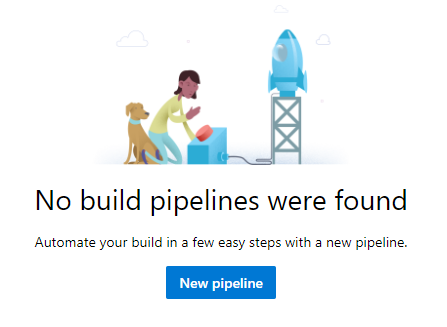
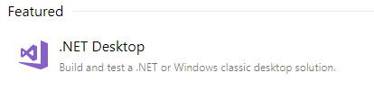
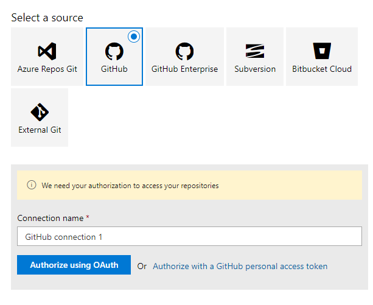
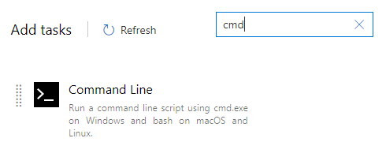

# InnoSetup integation with Azure DevOps CI-CD
## Continuous Integration + Continuous Deployment
innosetup is free  installer builder for windows [official site](http://www.jrsoftware.org/).


## Requirements
- [Inno Setup Downloads](http://www.jrsoftware.org/isdl.php)
- [Inno Script Studio](https://www.kymoto.org/products/inno-script-studio/) visual script builder
- [free github account](https://github.com/)
- [azure devops account](https://azure.microsoft.com/en-us/pricing/details/devops/azure-devops-services/)

## Steps
### 1. In visual studio project add the nuget package "Tools.InnoSetup"
### 2. Use (Script Studio) to generate "Script.iss" in visual studio project folder

- In github install "Azure Pipelines" from "Marketplace"


### 3. In Azure devops create build that uses ".net desktop" template





### 4. Select github and authorize usin OAuth



### 5. To the "Agent job 1" Add "Command Line" task



### 6. with sample script like :
```bat
SET PATH=packages\Tools.InnoSetup.5.6.1\tools
iscc InnoSetupWinform\Script.iss
```
- run your build.
- add new release 
- add empty job stage
- add GitHub release task


